# Track 2 - Development with Mac #
You will develop an iOS and Android application.  

## Before starting

* Make sure you have [Xamarin](http://developer.xamarin.com/guides/cross-platform/getting_started/introducing_xamarin_studio/) (and Xamarin Studio) installed :)

## Create Project

Open Xamarin Studio.

* 1) File => New => Solution

* 2) Choose Multiplatform/Cross Platform => App => Single View App => Next
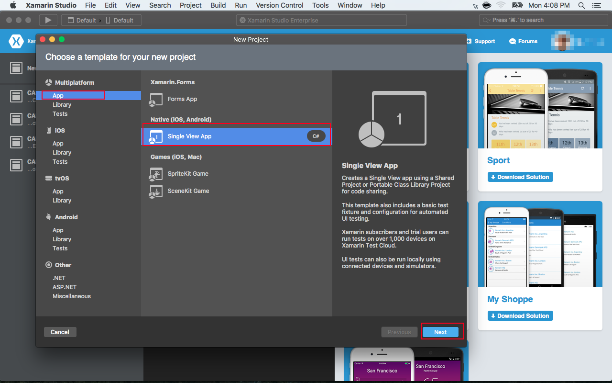

* 3) Give it a name => Select Android and iOS as Target Platforms => Choose "Use Portable Class Library" => Next => (in the next page just press Create)
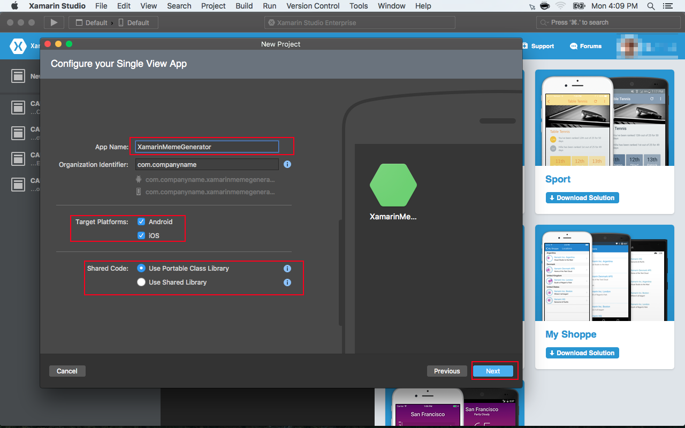

Xamarin Studio will generate a template for Android / iOS using a Portable Class Library to share code.

You Solution Explorer should look like this now:
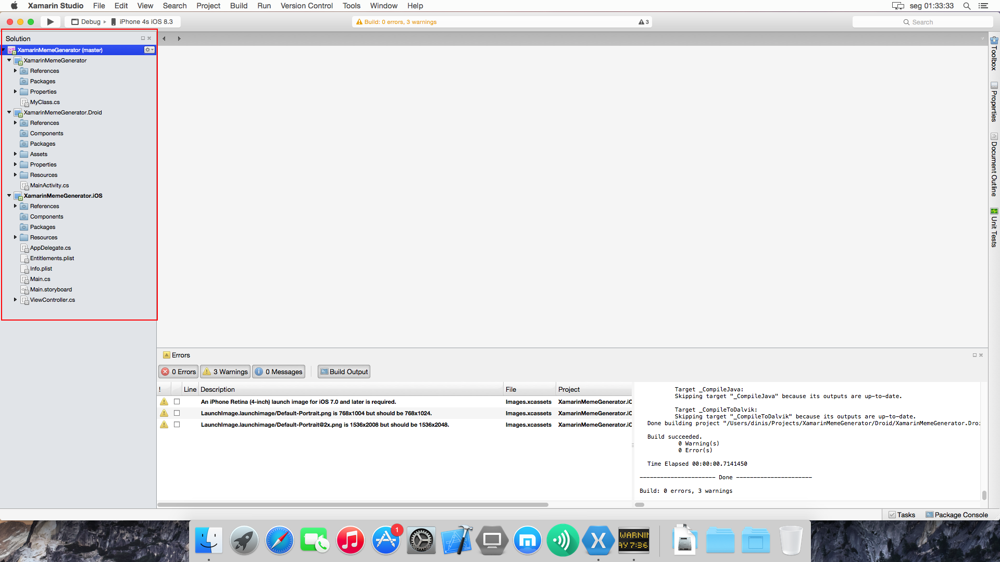

> + XamarinMemeGenerator is our Portable Class Library, meant to share code between platforms.
> + XamarinMemeGenerator.Droid is the project specific to the Android platform.
> + XamarinMemeGenerator.iOS is the project specific to the iOS platform.

* 4) Login / Create Xamarin Account (this might not be necessary if you have already done it in the past.
	* Xamarin Studio => Account => Login (Create Account if necessary)

## Let's get some work done

So, we want to build an application capable of building [Meme's](http://gizmodo.com/what-exactly-is-a-meme-512058258), for that we'll need to use an API that gives us a list of meme's and then allows us to send it the selected meme, some captions and return a meme image.

This is the screenshot of the application we want to build (Android version).

### Create shared code that accesses the Meme Generation API

* 1) In the XamarinMemeGenerator Project delete the "MyClass.cs"
	* Right-click the MyClass.cs file and select "Remove"
* 2) Create a new Class called "Memes.cs" (or something else you want, I'm not good with names :)
	* Right-click the XamarinMemeGenerator Project => Add => New file => Choose "Empty Class" from the list, give it a name and click "New"

* 3) This is definitely cheating, but here goes the code for this class...

		public static class Memes
		{
		
			private static string MASHAPE_API_KEY = "REPLACE_THIS_WITH_THE_MASHAPE_API_KEY";
		
			//Gets a list of all available memes on this API
			public static async Task<ObservableCollection<string>>  GetMemesList()
			{
		
				var client = new HttpClient();
		
				//headers required to call the service (API key and Accept type)
				client.DefaultRequestHeaders.Add("X-Mashape-Key", MASHAPE_API_KEY);
				client.DefaultRequestHeaders.Add("Accept", "text/plain");
		
				//Actually calls the service and returns a json string
				string response = await client.GetStringAsync("https://ronreiter-meme-generator.p.mashape.com/images");

				//converts json string into a ObservableCollection of strings
				var tmpList = JsonConvert.DeserializeObject<ObservableCollection<string>>(response);

				//Regex for cleaning some garbage from results
				Regex regexFirstCharIsDigit = new Regex(@"\d");
				ObservableCollection<string> memesList = new ObservableCollection<string>();

				//This API has some garbage, so let's clean some of the bad items
				foreach (string item in tmpList)
				{ 
					if (!string.IsNullOrWhiteSpace(item) && !regexFirstCharIsDigit.IsMatch(item)) //is item is not null or whitespace and doesn't have digits then add to list
					{
						memesList.Add(item);
					}
				}
				return memesList;
		
			}
			
			//Given a meme, top and bottom texts this will return an image
			public static async Task<byte[]> GenerateMeme(string meme, string topText, string bottomText)
			{
		
				//This Meme Generator Api has a problem with non-ascii chars, so we strip them just to avoid it crashing.
				bottomText = Regex.Replace(bottomText, @"[^\u0000-\u007F]", string.Empty);
				topText = Regex.Replace(topText, @"[^\u0000-\u007F]", string.Empty);
		
				var client = new HttpClient();
		
				//headers required to call the service (API key and Accept type)
				client.DefaultRequestHeaders.Add("X-Mashape-Key", MASHAPE_API_KEY);
		
				//Actually calls the service and returns a byte array for the image
				return await client.GetByteArrayAsync("https://ronreiter-meme-generator.p.mashape.com/meme?bottom="+bottomText+"&meme="+meme+"&top="+topText);
		
			}
		}

> This class contains two methods, on returns a list of string with the possible meme's we can use and the other allows us to send a chosen meme, top and bottom text to get an Image. 

> You might notice there's a Mashape API Key on these methods, you can use it or…
> Get your own key for free in [here](https://www.mashape.com/ronreiter/meme-generator).

* 4) Add missing "usings/imports".
 
		using System.Collections.ObjectModel;
		using System.Net.Http;
		using System.Text.RegularExpressions;
		using System.Threading.Tasks;
* 5) You might notice "JsonConvert" is still "red" and so is "HttpClient", that's because we need to add a "plugin/Nuget" to this Shared project that handles Json and that HttpClient.
	* a) Select the XamarinMemeGenerator project, then Click "Project" on the top bar => Add Nuget Packages
	* b) A window will pop up, write "json" in the top-right corner box.
	* c) Install the Json.NET that shows on the list.  
	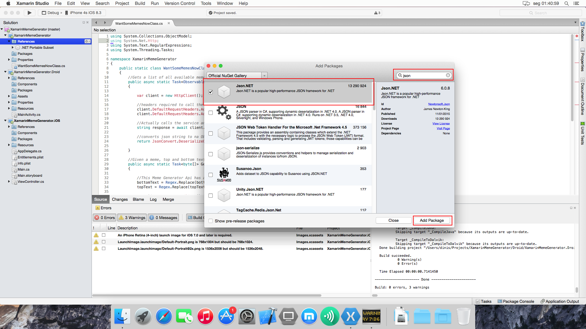
	* d) do the same for the HttpClient (write "xamarin studio http" on the box)
	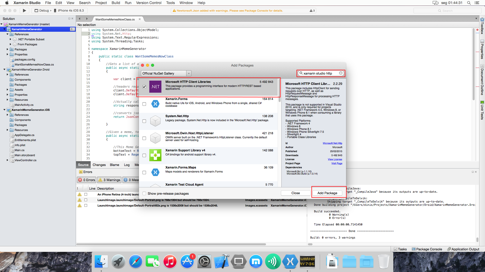

* 6) You can now import the required dependencies for the JsonConvert and HttpClient.
> You must repeat this process while selecting the iOS project

> One of the great things about using Xamarin is that you can still use all the plugins out there because Nuget is fully supported on these Portable Class Libraries.
So for example this Json.NET plugin will be used by both the Android and iOS platform.

### Create iOS Application

* 1) Let's do some work on our iOS app.
	* Start by setting it as the Startup Platform (Right-click XamarinMemeGenerator.iOS and select "Set as startup project")
* 2) Sanity check. The app should launch "as is", although it won't do anything besides display an blank page with a "hello button".
	* Make sure the configurations are set to Debug|iPhone Simulator and Run in one of the Emulators (see image below)
	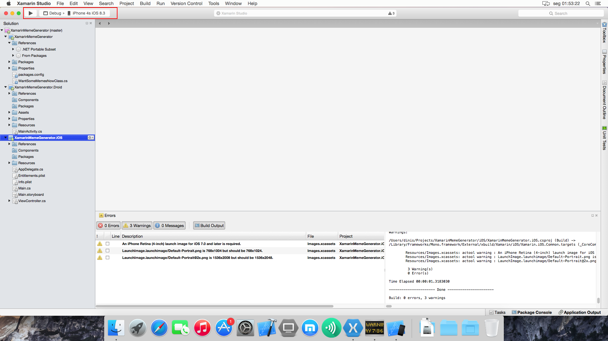

> If you can't find any iOS emulators you might need to install/run XCode before doing this. (Call me if you get stuck)

Hopefully the application did run, now let's move to actually coding some stuff :)  
In the image below are the two files we will work with:

* Main.storyboard.xaml which is a "View" (it's a bit more complicated than that actually :)
* ViewController.cs which is the controller for the "view" and it's written in c#

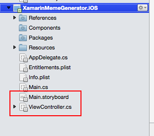

* 3) Open the Main.storyboard.
	* You should see something similar to the image below. (call me if you don't)
	* Read the tips in the image below
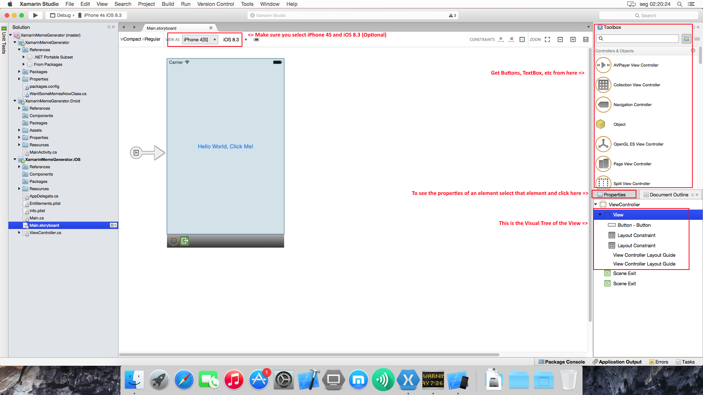

* 4) Create the View, drag the required elements to build a view like the image below.
	* Name the elements as explained in the image (the place to name them is in the Properties when you select an element)
	* You might need help, so don't hesitate in calling me!

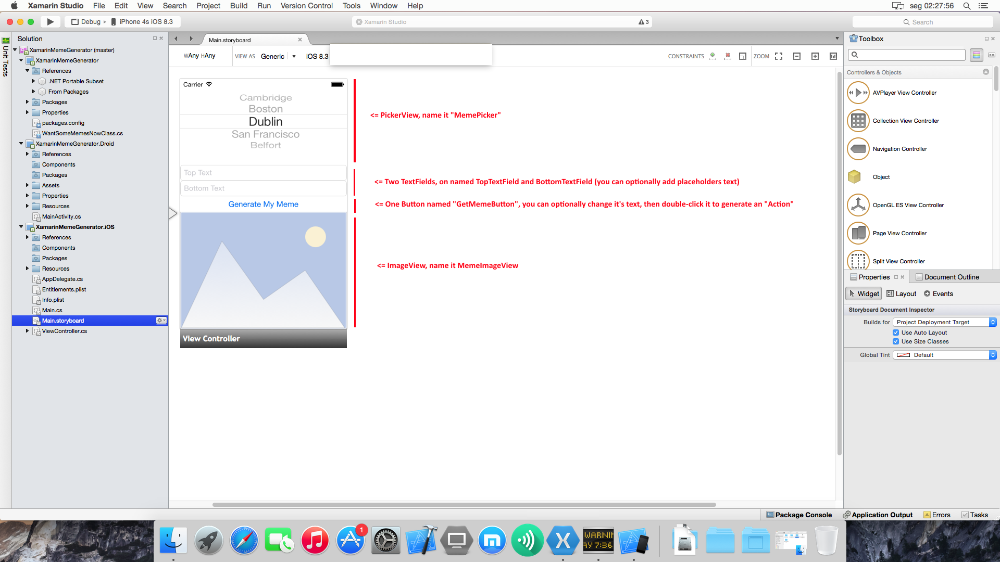

* 5) Now go to the ViewController.cs, you should have a "GetMemeButton_TouchUpInside" method in there, inside add this code:

			//Get current selected meme from the ViewPicker
			var rowSel = MemePicker.SelectedRowInComponent(new nint(0));
			var memeString = (MemePicker.Model as MemesPickerViewModel).GetTitle(rowSel);

        	//Calls the Shared Portable Class Library with the values of the PickerView and TextFields’s in this View.
        	//The returned value is the image in a byte array format 
			byte[] imageByteArr = await Memes.GenerateMeme(memeString, TopTextField.Text, BottomTextField.Text);
			//Create image
			var img = new UIImage(NSData.FromArray(imageByteArr));

 			//Set image to the Image Placeholder we have on our View
			MemeImageView.Image = img;

> Add any missing references. You might get an error on the "await's". Do you know what that is? Ask me! (Anyway, if you add an "async" to the method signature it will stop complaining.   
> << **async** partial void GetMemeButton_TouchUpInside (UIButton sender) >>

> This method is the one responsible to get the meme image. if you look close at it you'll notice it calls our Shared project with the values in the TextField's and PickerView and the transforms the returned byte array in an image to display.

* 6) You might notice we are missing a MemePickerViewModel, this is needed to support the native iOS PickerView. Just add the code below between the two last curly braces "}"
	* Again fix/resolve any dependencies.

			public class MemesPickerViewModel : UIPickerViewModel
			{
		
				private string[] _memesArr;
		
				public MemesPickerViewModel(ObservableCollection<string> memes){
					_memesArr = new string[memes.Count];
					memes.CopyTo (_memesArr, 0);
				}
		
				public string GetTitle (nint row)
				{
					return _memesArr[row];
				}
		
				public override nint GetComponentCount (UIPickerView pickerView)
				{
					return 1;
				}
						
				public override string GetTitle (UIPickerView pickerView, nint row, nint component)
				{
					return _memesArr[row];
				}
		
				public override nint GetRowsInComponent (UIPickerView pickerView, nint component)
				{
					return _memesArr.Length;
				}
			}

* 7) We already did lot's of stuff, but we are still missing the code to get the available meme's and display them on the PickerView.
	* To do that **replace** the following code in ViewController.cs "ViewDidLoad" method:

			// Perform any additional setup after loading the view, typically from a nib.
			Button.AccessibilityIdentifier = "myButton";
			Button.TouchUpInside += delegate {
				var title = string.Format ("{0} clicks!", count++);
				Button.SetTitle (title, UIControlState.Normal);
			};

	* **With this**

			//Calls the Shared Portable Class Library to get a list with all available meme's.
			ObservableCollection<string> memes = await Memes.GetMemesList ();

			//Set the list of memes we got to our PickerView (using the pickerViewModel we created)
			MemePicker.Model = new MemesPickerViewModel (memes);

> Add any missing references. You will probably get that "await" error again. Do you remember how to fix it?

> This method is the one responsible to get all the available memes in the API. It also uses our shared Portable Class Library as you can see.

* 8) This should do it! Try and run it just like you did on step 2)

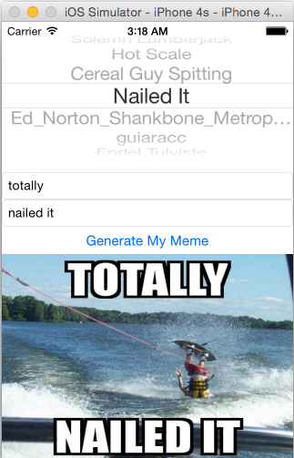

### Create Android Application

* 1) Let's do some work on our Android app.
	* Start by setting it as the Startup Platform (Right-click XamarinMemeGenerator.Droid and select "Set as startup project")
* 2) Sanity check. The app should launch "as is", although it won't do anything besides display a page with a hello button.
	* Make sure the configurations are set to Debug|Any CPU and Run in one of the Emulators (see image below)
	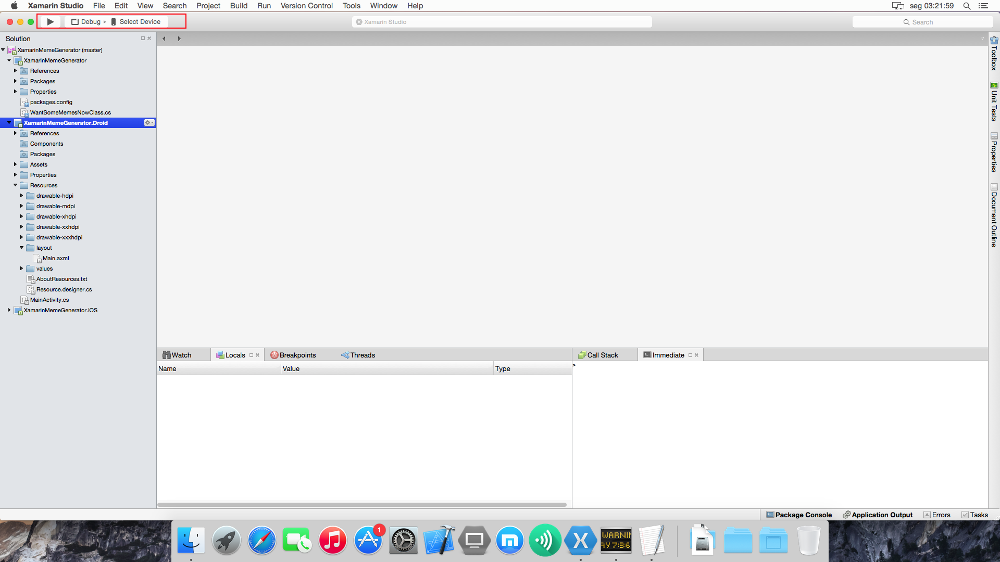
	
> NOTE: The emulator to lauch the app depends a lot on the Emulator application you are using. Ask for help if needed.

> Hopefully the application did run, now let's move to actually coding some stuff :)  
 
> In the image below are the two files we will work with:

* Main.axml which is a AXML (markup) file for the "view"
* MainActivity.cs which is the "code-behind" for the "view" and it's written in c#

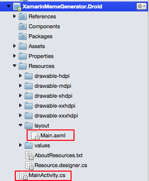

* 3) Like we did with the iOS app let's create the View for the Android app.
	* Go to the Main.axml file, you'll notice that you can both edit it Visually (Design) or just with code (Source), just like in the original Android editor.
	* To make things quicker, choose "Source" and replace all the contents with the code below.

			<?xml version="1.0" encoding="utf-8"?>
			<LinearLayout xmlns:android="http://schemas.android.com/apk/res/android"
		    android:orientation="vertical"
		    android:layout_width="fill_parent"
		    android:layout_height="fill_parent">
		    <Spinner
		        android:layout_width="match_parent"
		        android:layout_height="52.9dp"
		        android:id="@+id/spinnerMemes"
		        android:spinnerMode="dialog" />
		    <EditText
		        android:layout_width="match_parent"
		        android:layout_height="wrap_content"
		        android:hint="Top Text"
		        android:id="@+id/editTextTop" />
		    <EditText
		        android:layout_width="match_parent"
		        android:layout_height="wrap_content"
		        android:hint="Bottom Text"
		        android:id="@+id/editTextBottom" />
		    <Button
		        android:id="@+id/myButtonGenerate"
		        android:layout_width="match_parent"
		        android:layout_height="wrap_content"
		        android:text="Generate My Meme" />
		    <ImageView
		        android:src="@android:drawable/ic_menu_gallery"
		        android:layout_width="match_parent"
		        android:layout_height="350.1dp"
		        android:id="@+id/imageViewMeme" />
			</LinearLayout> 

> Just like the iOS version this code adds:  
> 
> * A Spinner to display all the meme's available
> * Two Textbox's where we add the top and bottom text for our meme.
> * A button to call the API and get our Meme
> * An image placeholder for our meme image

* 4) Now go to the "MainActivity.cs"

* 5) Inside the "OnCreate" method **replace the lines below**:

			// Get our button from the layout resource,
			// and attach an event to it
			Button button = FindViewById<Button> (Resource.Id.myButton);
			
			button.Click += delegate {
				button.Text = string.Format ("{0} clicks!", count++);
			};
**With this**:

            //Reference to all the View Elements
            Button button = FindViewById<Button>(Resource.Id.myButtonGenerate);
            Spinner memesSpinner = FindViewById<Spinner>(Resource.Id.spinnerMemes);
            EditText editTextTop = FindViewById<EditText>(Resource.Id.editTextTop);
            EditText editTextBottom = FindViewById<EditText>(Resource.Id.editTextBottom);
            ImageView imageViewMeme = FindViewById<ImageView>(Resource.Id.imageViewMeme);

            //Calls the Shared Portable Class Library to get a list with all available meme's.
            ObservableCollection<string> memes = await Memes.GetMemesList();

            //Set the list of memes to our Spinner and enable it
            var adapter = new ArrayAdapter<String>(this, Android.Resource.Layout.SimpleSpinnerItem, memes);
            memesSpinner.Adapter = adapter;

            button.Click += async delegate
            {
                //Calls the Shared Portable Class Library with the values of the Spinner and TextBox's in this View.
                //The returned value is the image in a byte array format 
                byte[] imageBytes = await Memes.GenerateMeme(memesSpinner.SelectedItem.ToString(), editTextTop.Text, editTextBottom.Text);

                //Create Image
                Bitmap bmp = BitmapFactory.DecodeByteArray(imageBytes, 0, imageBytes.Length);

                //Set image to the Image Placeholder we have on our View
                imageViewMeme.SetImageBitmap(bmp);
            };

> Add any missing references. And "fix" the "await".

> This method is the one responsible to get the meme image. if you look close at it you'll notice it calls our Shared project with the values in the Textbox's and Spinner and the transforms the returned byte array in an image to display.

* 6) This should do it! Try and run it just like you did on step 2)

### What about now? (Suggestions for your free time)

* 1) Add more functionality like sharing and saving the generated image
* 2) Build a proper UI (easier to use, with scrollviewer for smaller screens and/or more pages)
* 3) Get a Windows PC or use Parallels/VMWare to build the missing platform (Windows Phone)
* 4) Redo the whole application using [Xamarin.Forms](http://developer.xamarin.com/guides/cross-platform/xamarin-forms/) (Allows to also share UI code)
* 5) Share even more code by using MVVM pattern. [why?](http://stackoverflow.com/a/18711842/201096) (you can even do it with a framework like MVVMLight or MVVMCross)
* 6) Use a proper API. The API used in this Workshop is not that good (it's simple though), but you could try using a more complete/professional API.
