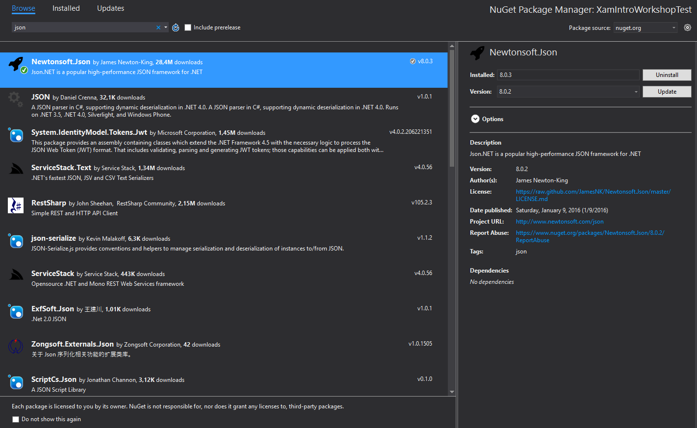

# Track 1 - Development with Windows #
You will develop a Windows Phone and Android application.  
It's also possible to create an iOS Application but that would require a Mac Build Host and it's not covered in this Guide.

## Before starting

* Make sure you have Visual Studio 2015 and Xamarin installed.

## Create Project

Open Visual Studio 2015.

* 1) File => New => Project

* 2) Choose "Visual C#" => "Cross Platfom" => Blank App (Native Portable) => Give it a name and "Ok"

Visual Studio will generate a template for Android / iOS / Windows Phone using a Portable Class Library to share code.

> Note: If a "Xamarin Mac Agent" window pops up just press "Close"

We don't want iOS on this Guide so let's remove the generated iOS Project

* 3) Right-click the Xamarin project and select "Remove"

You Solution Explorer should look similar to this now:

> + XamarinMemeGenerator is our Portable Class Library, meant to share code between platforms.
> + XamarinMemeGenerator.Droid is the project specific to the Android platform.
> + XamarinMemeGenerator.WinPhone is the project specific to the Windows Phone platform.

* 4) Login / Create Xamarin Account (this might not be necessary if you have already done it in the past.
	* Tools => Xamarin Account => Login (Create Account if necessary)

## Let's get some work done

So, we want to build an application capable of building [Meme's](http://gizmodo.com/what-exactly-is-a-meme-512058258), for that we'll need to use an API that gives us a list of meme's and then allows us to send it the selected meme, some captions and return a meme image.

This is the screenshot of the application we want to build (Windows Phone version).

### Create shared code that accesses the Meme Generation API

* 1) In the XamarinMemeGenerator Project delete the "MyClass.cs"
	* Right-click the MyClass.cs file and select "Delete"
* 2) Create a new Class called "WantSomeMemesNowClass.cs" (or something else you want, I'm not good with names :)
	* Right-click the XamarinMemeGenerator Project => Add => New item => Choose "Class" from the list, give it a name and click "Add"

* 3) This is definitley cheating, but here goes the code for this class...

		public static class WantSomeMemesNowClass
		{
			//Gets a list of all available memes on this API
			public static async Task<ObservableCollection<string>>  ShowMeThoseMemes()
			{
		
				var client = new HttpClient();
		
				//headers required to call the service (API key and Accept type)
				client.DefaultRequestHeaders.Add("X-Mashape-Key", "XBbhHT1nvvmshsTLVkHJuWlfdUepp17mN4HjsnIpb54NzH04fZ");
				client.DefaultRequestHeaders.Add("Accept", "text/plain");
		
				//Actually calls the service and returns a json string
				string response = await client.GetStringAsync("https://ronreiter-meme-generator.p.mashape.com/images");
		
				//converts json string to na ObservableCollection of strings
				return JsonConvert.DeserializeObject<ObservableCollection<string>>(response);
		
			}
			
			//Given a meme, top and bottom texts this will return an image
			public static async Task<byte[]> GenerateMyMeme(string meme, string topText, string bottomText)
			{
		
				//This Meme Generator Api has a problem with non-ascii chars, so we strip them just to avoid it crashing.
				bottomText = Regex.Replace(bottomText, @"[^\u0000-\u007F]", string.Empty);
				topText = Regex.Replace(topText, @"[^\u0000-\u007F]", string.Empty);
		
				var client = new HttpClient();
		
				//headers required to call the service (API key and Accept type)
				client.DefaultRequestHeaders.Add("X-Mashape-Key", "XBbhHT1nvvmshsTLVkHJuWlfdUepp17mN4HjsnIpb54NzH04fZ");
		
				//Actually calls the service and returns a byte array for the image
				return await client.GetByteArrayAsync("https://ronreiter-meme-generator.p.mashape.com/meme?bottom="+bottomText+"&meme="+meme+"&top="+topText);
		
			}
		}

> This class contains two methods, one returns a list of strings with the possible meme's we can use and the other allows us to send a chosen meme, top and bottom text to get an Image. 

> You might notice there's a Mashape API Key on these methods, you can use it or....
> Get your own key for free in [here](https://www.mashape.com/ronreiter/meme-generator).

* 4) Add missing "usings/imports".
 
		using System.Collections.ObjectModel;
		using System.Net.Http;
		using System.Text.RegularExpressions;
		using System.Threading.Tasks;
* 5) You might notice "JsonConvert" is still "red", that's because we need to add a "plugin/Nuget" to this Shared project that handles Json.
	* a) Right Click the XamarinMemeGenerator project => Manage Nuget Packages
	* b) Choose "Browse" on the window that opens and write "json" in the Search box.
	* c) Install the Newtonsoft.Json that shows on the list.  
	

* 6) You can now import the required dependecy for the JsonConvert
> One of the great things about using Xamarin is that you can still use all the plugins out there because Nuget is fully supported on these Portable Class Libraries.
So for example this Json.NET plugin will be used by both the Android and Windows Phone platform.

### Create Windows Phone Application

* 1) Let's do some work on our Windows Phone app.
	* Start by setting it as the Startup Platform (Right-click XamarinMemeGenerator.WinPhone and select "Set as startup project")
* 2) Sanity check. The app should launch "as is", although it won't do anything besides display a blank page with a button on it.
	* Make sure the configurations are set to Debug|Any CPU and Run in one of the Emulators (see image below)
	

Hopefully the application did run, now let's move to actually coding some stuff :)  
In the image below are the two files we will work with:

* MainPage.xaml which is a XAML (markup) file for the "view"
* MainPage.xaml.cs which is the "code-behind" for the "view" and it's written in c#

* 3) Open the MainPage.xaml and replace the existing 3 lines of markup code with the StackPanel and Button code with the Grid defined in the code below.

        <Grid>
	        <Grid.ColumnDefinitions>
	            <ColumnDefinition/>
	            <ColumnDefinition/>
	        </Grid.ColumnDefinitions>
	        <Grid.RowDefinitions>
	            <RowDefinition Height="Auto"/>
	            <RowDefinition Height="Auto"/>
	            <RowDefinition/>
	        </Grid.RowDefinitions>
	        <StackPanel Grid.Row="0" Grid.Column="0" Grid.ColumnSpan="2">
	            <ComboBox x:Name="MemesListView" 
	                      VerticalAlignment="Stretch" 
	                      HorizontalAlignment="Stretch" IsEnabled="False">
	            </ComboBox>
	        </StackPanel>
	        <StackPanel Grid.Column="0" Grid.Row="1" Grid.ColumnSpan="2">
	            <TextBox x:Name="TopTextBox" PlaceholderText="Top Text"></TextBox>
	            <TextBox x:Name="BottomTextBox" PlaceholderText="Bottom Text"></TextBox>
	            <Button x:Name="GenerateMyMeme" Tapped="GenerateMyMemeBtn_OnTapped">Generate My Meme</Button>
	        </StackPanel>
	        <Image x:Name="Image" Grid.Row="2" Grid.Column="0" Grid.ColumnSpan="2"></Image>
        </Grid>

> This code adds:  
> 
> * A ComboBox to display all the meme's available
> * Two Textbox's where we add the top and bottom text for our meme.
> * A button to call the API and get our Meme
> * An image placeholder for our meme image

* 4) You might notice an error in "GenerateMyMemeBtn_OnTapped", right-click it and choose "Go to definition". (you will be "switched" to the code-behind (MainPage.xaml.cs)
* 5) Inside the newly generated method for the Button event (GenerateMyMemeBtn_OnTapped) add the following.

        if (MemesListView.SelectedValue == null) { return; } //make sure we have a selected value

        //Calls the Shared Portable Class Library with the values of the ComboBox and TextBox's in this View.
        //The returned value is the image in a byte array format 
        byte[] imageBytes = await WantSomeMemesNowClass.GenerateMyMeme(MemesListView.SelectedValue.ToString(), TopTextBox.Text, BottomTextBox.Text);

        //Create Image
        var bitmapImage = new BitmapImage();
        var stream = new InMemoryRandomAccessStream();
        await stream.WriteAsync(imageBytes.AsBuffer());
        stream.Seek(0);
        bitmapImage.SetSource(stream);
            
        //Set image to the Image Placeholder we have on our View
        Image.Source = bitmapImage;

> Add any missing references. You might get an error on the "await's". Do you know what that is? Ask me! (Anyway, if you add an "async" to the method signature it will stop complaining.   
> << private **async** void GenerateMyMemeBtn_OnTapped(object sender, TappedRoutedEventArgs e) >>

> This method is the one responsible to get the meme image. if you look close at it you'll notice it calls our Shared project with the values in the Textbox's and ComboBox and the transforms the returned byte array in an image to display.

* 6) We already did lot's of stuff, but we are still missing the code to get the available meme's and display them on the ComboBox.
	* To do that replace all the existing code inside the "OnNavigatedTo" method with the one below:

            //Calls the Shared Portable Class Library to get a list with all available meme's.
            ObservableCollection<string> memes = await WantSomeMemesNowClass.ShowMeThoseMemes();

            //Set the list of memes to our ComboBox and enable it
            MemesListView.ItemsSource = memes;
            MemesListView.IsEnabled = true;

> Add any missing references. You will probably get that "await" error again. Do you remember how to fix it?

> This method is the one responsible to get all the available memes in the API. It also uses our shared Portable Class Library as you can see.

* 7) This should do it! Try and run it just like you did on step 2)

### Create Android Application

* 1) Let's do some work on our Android app.
	* Start by setting it as the Startup Platform (Right-click XamarinMemeGenerator.Droid and select "Set as startup project")
* 2) Sanity check. The app should launch "as is", although it won't do anything besides display a page with a hello button.
	* Make sure the configurations are set to Debug|Any CPU and Run in one of the Emulators (see image below)
	
> NOTE: The emulator to lauch the app depends a lot on the Emulator application you are using. Ask for help if needed.
> 
> Hopefully the application did run, now let's move to actually coding some stuff :)  
> 
> In the image below are the two files we will work with:

* Main.axml which is a AXML (markup) file for the "view"
* MainActivity.cs which is the "code-behind" for the "view" and it's written in c#

* 3) Like we did with the Windows Phone app let's create the View for the Android app.
	* Go to the Main.axml file, you'll notice that you can both edit it Visually (Design) or just with code (Source), just like in the original Android editor.
	* To make things quicker, choose "Source" and replace all the contents with the code below.

			<?xml version="1.0" encoding="utf-8"?>
			<LinearLayout xmlns:android="http://schemas.android.com/apk/res/android"
		    android:orientation="vertical"
		    android:layout_width="fill_parent"
		    android:layout_height="fill_parent">
		    <Spinner
		        android:layout_width="match_parent"
		        android:layout_height="52.9dp"
		        android:id="@+id/spinnerMemes"
		        android:spinnerMode="dialog" />
		    <EditText
		        android:layout_width="match_parent"
		        android:layout_height="wrap_content"
		        android:hint="Top Text"
		        android:id="@+id/editTextTop" />
		    <EditText
		        android:layout_width="match_parent"
		        android:layout_height="wrap_content"
		        android:hint="Bottom Text"
		        android:id="@+id/editTextBottom" />
		    <Button
		        android:id="@+id/myButtonGenerate"
		        android:layout_width="match_parent"
		        android:layout_height="wrap_content"
		        android:text="Generate My Meme" />
		    <ImageView
		        android:src="@android:drawable/ic_menu_gallery"
		        android:layout_width="match_parent"
		        android:layout_height="350.1dp"
		        android:id="@+id/imageViewMeme" />
			</LinearLayout> 

> Just like the Windows Phone version this code adds:  
> 
> * A Spinner to display all the meme's available
> * Two Textbox's where we add the top and bottom text for our meme.
> * A button to call the API and get our Meme
> * An image placeholder for our meme image

* 4) Now go to the "MainActivity.cs"

* 5) Inside the "OnCreate" method **replace the lines below**:

			// Get our button from the layout resource,
			// and attach an event to it
			Button button = FindViewById<Button> (Resource.Id.myButton);
			
			button.Click += delegate {
				button.Text = string.Format ("{0} clicks!", count++);
			};
**With this**:

            //Reference to all the View Elements
            Button button = FindViewById<Button>(Resource.Id.myButtonGenerate);
            Spinner memesSpinner = FindViewById<Spinner>(Resource.Id.spinnerMemes);
            EditText editTextTop = FindViewById<EditText>(Resource.Id.editTextTop);
            EditText editTextBottom = FindViewById<EditText>(Resource.Id.editTextBottom);
            ImageView imageViewMeme = FindViewById<ImageView>(Resource.Id.imageViewMeme);

            //Calls the Shared Portable Class Library to get a list with all available meme's.
            ObservableCollection<string> memes = await WantSomeMemesNowClass.ShowMeThoseMemes();

            //Set the list of memes to our Spinner and enable it
            var adapter = new ArrayAdapter<String>(this, Android.Resource.Layout.SimpleSpinnerItem, memes);
            memesSpinner.Adapter = adapter;

            button.Click += async delegate
            {
                //Calls the Shared Portable Class Library with the values of the Spinner and TextBox's in this View.
                //The returned value is the image in a byte array format 
                byte[] imageBytes = await WantSomeMemesNowClass.GenerateMyMeme(memesSpinner.SelectedItem.ToString(), editTextTop.Text, editTextBottom.Text);

                //Create Image
                Bitmap bmp = BitmapFactory.DecodeByteArray(imageBytes, 0, imageBytes.Length);

                //Set image to the Image Placeholder we have on our View
                imageViewMeme.SetImageBitmap(bmp);
            };

> Add any missing references. And "fix" the "await".

> This method is the one responsible to get the meme image. if you look close at it you'll notice it calls our Shared project with the values in the Textbox's and ComboBox and the transforms the returned byte array in an image to display.

* 6) This should do it! Try and run it just like you did on step 2)

### What about now? (Suggestions for your free time)

* 1) Get a Mac a use it as a Build Host to build the missing platform (iOS): [link](http://developer.xamarin.com/guides/ios/getting_started/installation/windows/introduction_to_xamarin_ios_for_visual_studio/)
* 2) Add more functionality like sharing and saving the generated image
* 3) Redo the whole application using [Xamarin.Forms](http://developer.xamarin.com/guides/cross-platform/xamarin-forms/) (Allows to also share UI code)
* 4) Share even more code by using MVVM pattern. [why?](http://stackoverflow.com/a/18711842/201096)
* 5) Use a proper API. The API used in this Workshop is not that good (it's simple though), but you could try using a more complete/professional API.
